# os-proxy-resolver

Resolve the OS-configured proxy for a URL — static config, PAC scripts, and
WPAD — with change notification and a bad-proxy feedback loop.

```rust
use os_proxy_resolver::{resolve_proxy, ProxyKind};

let url = url::Url::parse("https://example.com/").unwrap();
for proxy in resolve_proxy(&url)? {
    match proxy {
        ProxyKind::Direct => { /* connect directly */ }
        ProxyKind::Http(host_port) => { /* HTTP proxy (CONNECT for https) */ }
        ProxyKind::Socks(host_port) => { /* SOCKS proxy */ }
    }
}
```

Results mirror PAC semantics: `"PROXY a:8080; DIRECT"` → an *ordered* fallback
list `[Http("a:8080"), Direct]`. The API is synchronous; PAC evaluation runs
on a dedicated worker thread. Calls may block on network I/O up to configured
timeouts, so use `spawn_blocking` (or similar) from async runtimes.

## Architecture



The diagram shows the sandboxed Wasmtime backend, which is the default. The PAC
backend is selected explicitly at build time — see [PAC backends](#pac-backends).

## Resolution precedence

1. `http_proxy` / `https_proxy` / `all_proxy` / `no_proxy` env vars
   (lowercase or uppercase; `no_proxy` supports hosts, `.suffix`, globs,
   `host:port`, CIDR, `*`)
2. OS proxy configuration: WPAD auto-detect → configured PAC URL → static
   per-scheme rules with bypass list
3. `DIRECT`

PAC/WPAD failures fall through to the next layer instead of failing the
resolution.

## Platform strategy

| | config source | PAC + WPAD | change signal |
|---|---|---|---|
| **Windows** | `WinHttpGetIEProxyConfigForCurrentUser` | WinHTTP `WinHttpGetProxyForUrl` (PAC eval + DHCP/DNS WPAD in the OS) | registry change notification |
| **macOS** | `SCDynamicStoreCopyProxies` | built-in [QuickJS] PAC engine + DNS WPAD | `SCDynamicStore` callback |
| **Linux** | GNOME `org.gnome.system.proxy` via `gsettings` | built-in [QuickJS] PAC engine + DNS WPAD | `dconf watch` / `gsettings monitor` |

### PAC backends

Off Windows (and, if you opt in, on Windows) PAC scripts run on an embedded
engine, selected explicitly via Cargo features:

- **`pac-engine`** — native QuickJS-NG, compiled from C via the MIT-licensed
  `rquickjs-sys` crate (needs a C compiler; no autotools/make, so
  cross-compilation stays clean). Works on every target, including 32-bit
  armv7.
- **`pac-engine-wasmtime`** — the same QuickJS-NG compiled to wasm32-wasip1
  (see [`pac-wasm-guest/`](pac-wasm-guest)) and run under Wasmtime. Pure Rust
  to build (no C compiler), but can't target platforms Cranelift can't
  AOT-compile for, such as armv7. **This is the default.**
- **`pac-engine-wasm2c`** — the same wasm guest translated to portable C with
  WABT's [`wasm2c`](https://github.com/WebAssembly/wabt) at build time and
  compiled like any other C code: the wasm sandbox for every target a C
  compiler exists for, **including 32-bit armv7**. Slower than the Wasmtime
  backend (explicit bounds checks on every memory access) and needs the pinned
  `wasm2c` binary on the build host (see
  [`pac-wasm-guest/README.md`](pac-wasm-guest/README.md)).

Enable at least one; the three are independent, and enabling several lets them
be compared (the `pac_bench` benchmark does exactly that). Which one evaluates
a script is chosen per resolver with `ResolverOptions::pac_backend`, defaulting
to Wasmtime when it is compiled in (then native, then wasm2c). Off Windows a backend is **required** —
building with neither is a compile error. On Windows WinHTTP handles PAC, so a
backend-less build is valid and stays **pure Rust**. The PAC helper functions
are first-party JavaScript implemented from the public PAC specification.

Non-goals: DHCP-based WPAD (option 252) on macOS/Linux (Windows gets it via
WinHTTP), KDE proxy settings, proxy authentication credentials.

## The PAC cage

A PAC file is untrusted JavaScript running on a live JS engine. The embedded
QuickJS context is neither `Send` nor `Sync`, and its `dnsResolve()` /
`myIpAddress()` builtins block on real network I/O. Containment:

- **One process-global worker thread** owns the PAC engine; every
  parse/find_proxy is serialized through a command channel.
- **Hard timeout** on every `FindProxyForURL` call. A runaway JS loop is
  interrupted inside the engine by its own deadline; a blocking native
  builtin (e.g. slow DNS) that outlasts the caller's deadline makes
  subsequent calls fail fast into the fallback path instead of queueing,
  and service resumes once the worker recovers.
- **URL sanitization** before evaluation (Chromium-style): identity is always
  stripped; for https URLs the path and query are dropped, so a hostile
  PAC/WPAD author can't read request details.
- The worker protocol is process-agnostic by design, so the evaluator can
  later be moved out-of-process entirely (subprocess with resource limits you
  can kill) — the Chromium end-state.
- **Optional WebAssembly containment** (`--features pac-engine-wasmtime`, any
  platform): the same QuickJS-NG, compiled to wasm32-wasip1 (see
  [`pac-wasm-guest/`](pac-wasm-guest)) and run under Wasmtime, selected per
  resolver with `ResolverOptions::pac_backend`. A memory-safety bug in the C
  engine triggered by a hostile PAC then corrupts the guest's linear memory
  instead of host memory, and the script's only reach into the process is the
  DNS/local-IP/log callbacks — no filesystem, network, environment, or other
  WASI capability exists inside the sandbox. Wasmtime runs in **AOT mode
  only**: build.rs precompiles the vendored guest module (Cranelift runs at
  build time as a build-dependency), the runtime dependency contains no
  JIT/compiler at all, and only `Module::deserialize` of that trusted
  first-party artifact happens at runtime. Runaway scripts are stopped by
  epoch interruption; memory is capped both by QuickJS's own 64 MiB limit
  inside the guest and a cap on the wasm linear memory. It is the default
  backend (`default = ["pac-engine-wasmtime"]`) and the default `pac_backend`;
  see [PAC backends](#pac-backends) for selecting it or the native engine.

WPAD discovery is aggressive about not stalling: `wpad.<search-domain>` DNS
probes get ~300ms each (walking up the domain, never into a TLD), the
`wpad.dat` fetch 2s, and negative results are cached.

## Change notification

Identical API on all platforms:

```rust
let resolver = os_proxy_resolver::ProxyResolver::new();

// 1. Generation counter — cheap synchronous poll for cache staleness.
let generation = resolver.config_generation();

// 2. Callback — runs on the watcher thread; keep it cheap, never call
//    resolve_proxy() from it. Drop the subscription to unregister.
let sub = resolver.on_change(|| { /* schedule re-resolution elsewhere */ });

// 3. Optional, with `--features tokio`:
let mut rx = resolver.watch(); // tokio::sync::watch::Receiver<u64>
```

These are the primitives an FFI bridge adapts — e.g. a napi-rs
`ThreadsafeFunction` (NonBlocking, unref'd) feeding a Node `EventEmitter`
`'change'` event, with `config_generation` exposed as a sync getter (i64 in
JS). The payload is intentionally dumb: "changed", no diff.

VPN connect, Wi-Fi switch, and resume all invalidate cached PAC state: caches
store the generation they were built at and re-resolve when it moves.

## Bad-proxy feedback

```rust
resolver.report_proxy_failed(&proxy);
```

marks a proxy dead for a cooldown (default 5 min); subsequent resolutions
demote it to the end of the list — so `"PROXY a; PROXY b; DIRECT"` stops
retrying dead `a` first on every request (mirrors Chromium's
`ProxyRetryInfo`). If everything in a list is marked bad, the original order
is returned and retried.

## Building

```sh
git clone <repo>
cargo build                                                # default: sandboxed Wasmtime backend (pure Rust, no C compiler)
cargo build --no-default-features --features pac-engine    # native QuickJS backend (needs a C compiler)
cargo build --no-default-features --features pac-engine-wasm2c  # portable sandbox (needs C compiler + pinned wasm2c)
cargo test
```

(Off Windows, `cargo build --no-default-features` with no backend feature is a
compile error; on Windows it is a valid pure-Rust WinHTTP-only build.)

Examples:

```sh
cargo run --example resolve -- https://example.com/   # live OS config
cargo run --example resolve -- --watch                # watch for changes
cargo run --example proxytester -- --pac-script file.pac http://url/ # test a PAC file
```

To compare the PAC engines head-to-head — WinHTTP (Windows), the embedded
native QuickJS engine, and the two sandboxed engines — on the same script
and URLs, run the `pac_bench` example with the engine features enabled:

```sh
cargo run --release --example pac_bench --features "pac-engine pac-engine-wasmtime pac-engine-wasm2c"
```

The benchmark cross-checks all engines and fails if the embedded backends
(byte-identical engine sources) disagree on any URL; it also reports the size
of the embedded AOT-compiled guest module.

Builds as both `rlib` and `cdylib`. Release automation with `cargo-dist` is a
natural fit (the CI matrix below already covers the seven targets) but is not
wired up yet.

## CI

GitHub Actions builds and tests **every PAC backend on every platform it
supports**: native + Wasmtime + wasm2c on Windows x64 + arm64, macOS x64 +
arm64, and Linux x86_64 + aarch64; native + wasm2c on Linux armv7 (which
Cranelift can't AOT-compile for — wasm2c is what makes the sandbox reachable
there; `cross` supplies the C toolchain and the containerized `wasm2c`). The
shipped `proxytester` artifact uses the Wasmtime backend everywhere except
armv7, which uses wasm2c. A variants job builds the single-backend
configurations (WinHTTP-only pure-Rust Windows, native-only, Wasmtime-only,
wasm2c-only), and another job asserts that building with no backend off
Windows is a compile error. Benchmark jobs run on **Windows, macOS, Linux, and
Linux armv7 (qemu)**: `pac_bench` times every engine available on that OS
(WinHTTP + native + Wasmtime + wasm2c on Windows; native + both sandboxes on
macOS/Linux; native + wasm2c on armv7), cross-checks them, and reports the
per-backend binary-size deltas, and [`bench/electron`](bench/electron) times
Chromium's own V8 PAC resolver (what Electron uses by default) as the baseline
next to the in-process numbers.

## License

The first-party code in this repository is licensed under the [MIT License](LICENSE.txt),
Copyright (c) Microsoft Corporation.

The native PAC engine (`pac-engine`) embeds QuickJS-NG (MIT) via the
MIT-licensed `rquickjs-sys` crate, statically linked into the compiled library.
The sandboxed backend (`pac-engine-wasmtime`, the default) additionally embeds
the Apache-2.0 (with LLVM exception) licensed Wasmtime runtime and a wasm build
of QuickJS-NG (via the Apache-2.0-licensed Javy crate). The portable sandboxed
backend (`pac-engine-wasm2c`) compiles C generated by WABT's `wasm2c` from that
same wasm build, together with WABT's Apache-2.0-licensed `wasm-rt` runtime
sources (vendored under `pac-wasm-guest/wasm-rt/`). The PAC helper functions
are first-party JavaScript implemented from the public PAC specification.
Everything is permissively licensed. A `--no-default-features` Windows build
contains no JavaScript engine at all (WinHTTP handles PAC).

[QuickJS]: https://github.com/quickjs-ng/quickjs
